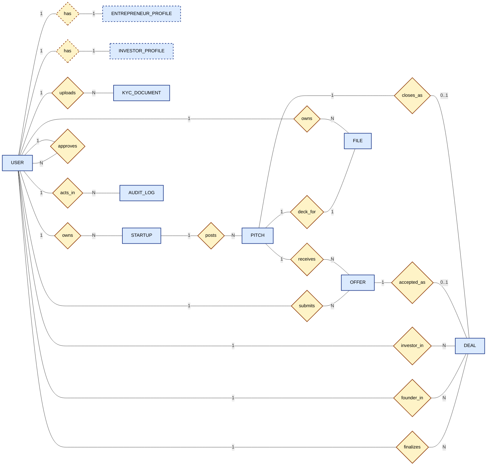

# ER Diagram — Shark Tank Platform (v1 — final)

10 tables. Open in any Mermaid viewer (VS Code "Markdown Preview Mermaid Support" extension, GitHub, or [mermaid.live](https://mermaid.live)).

Changes since previous version: borrowed 4 nullable financial fields from BiZvest (`valuation_inr`, `last_year_profit_inr`, `burn_rate_inr_monthly` on `PITCH`; `net_worth_inr` on `INVESTOR_PROFILE`). No new tables, no new relationships.

Two views of the same schema:
- **Classic (Chen) notation** — the original textbook ER style: rectangles, diamonds, cardinality on the lines. Best for showing structure at a glance.
- **Modern (Crow's-foot) notation** — what Prisma / dbdiagram / DBeaver speak. Best for code generation and full attribute listing.

---

## 1. Classic (Chen) notation

Reading guide:
- **Solid rectangle** = strong entity (has its own primary key)
- **Dashed rectangle** = weak entity (its PK is the FK to its parent — `ENTREPRENEUR_PROFILE.user_id` and `INVESTOR_PROFILE.user_id`)
- **Solid diamond** = regular relationship
- **Dashed diamond** = identifying relationship (the one that gives a weak entity its identity)
- **Line label** = cardinality on that side (`1`, `N`, `0..1`)
- Attributes are omitted here for legibility — see the Crow's-foot view below for the full column list.



### Relationships at a glance

| Relationship | Reads as | Cardinality |
|---|---|---|
| `USER — has — ENTREPRENEUR_PROFILE` | A user (if role=entrepreneur) has exactly one entrepreneur profile | 1 : 1 (identifying) |
| `USER — has — INVESTOR_PROFILE` | A user (if role=investor) has exactly one investor profile | 1 : 1 (identifying) |
| `USER — uploads — KYC_DOCUMENT` | A user uploads many KYC documents | 1 : N |
| `USER — owns — STARTUP` | An entrepreneur owns many startups | 1 : N |
| `USER — approves — USER` | An admin approves many users (self-referential) | 1 : N |
| `STARTUP — posts — PITCH` | A startup posts many pitches over time | 1 : N |
| `PITCH — receives — OFFER` | A pitch receives many offers from different investors | 1 : N |
| `USER — submits — OFFER` | An investor submits many offers across pitches | 1 : N |
| `PITCH — closes_as — DEAL` | A pitch may close into at most one deal | 1 : 0..1 |
| `OFFER — accepted_as — DEAL` | An offer may be accepted, becoming the deal | 1 : 0..1 |
| `USER — investor_in — DEAL` | A user (investor) is on the investor side of many deals | 1 : N |
| `USER — founder_in — DEAL` | A user (entrepreneur) is on the founder side of many deals | 1 : N |
| `USER — finalizes — DEAL` | An admin finalizes many deals | 1 : N |
| `USER — acts_in — AUDIT_LOG` | A user is the actor of many audit-log rows | 1 : N |
| `USER — owns — FILE` | A user owns many uploaded files | 1 : N |
| `PITCH — deck_for — FILE` | A pitch has exactly one deck PDF (a file) | 1 : 1 |

---

## 2. Modern (Crow's-foot) notation — for code generation

Same schema, machine-readable, maps 1:1 to Prisma models.

```mermaid
erDiagram
    USER {
        string id PK
        string email UK
        string password_hash
        string phone
        enum role "admin | investor | entrepreneur"
        enum status "pending | approved | rejected | suspended"
        datetime email_verified_at
        datetime phone_verified_at
        string approved_by_admin_id FK "USER.id (nullable)"
        datetime approved_at
        datetime created_at
        datetime updated_at
    }

    ENTREPRENEUR_PROFILE {
        string user_id PK_FK
        string display_name
        string bio
        string proof_doc_file_id FK "FILE.id"
        datetime created_at
        datetime updated_at
    }

    INVESTOR_PROFILE {
        string user_id PK_FK
        string display_name
        string pan_number
        string pan_doc_file_id FK "FILE.id"
        bigint net_worth_inr "nullable, borrowed from BiZvest"
        int investment_min_inr
        int investment_max_inr
        json sector_interests "string[] of category enum"
        string bio
        datetime created_at
        datetime updated_at
    }

    KYC_DOCUMENT {
        string id PK
        string user_id FK
        enum doc_type "startup_proof | pan | other"
        string file_id FK "FILE.id"
        enum status "pending | approved | rejected"
        string reviewed_by_admin_id FK "USER.id (nullable)"
        datetime uploaded_at
        datetime reviewed_at
    }

    STARTUP {
        string id PK
        string owner_user_id FK "USER.id (entrepreneur)"
        string name
        enum sector "FinTech | EdTech | HealthTech | FoodTech | D2C | SaaS | Other"
        int founded_year
        string website_url
        string logo_file_id FK "FILE.id (nullable)"
        string description
        string location_city
        datetime created_at
        datetime updated_at
    }

    PITCH {
        string id PK
        string startup_id FK
        string title
        string description
        enum category "FinTech | EdTech | HealthTech | FoodTech | D2C | SaaS | Other"
        bigint ask_amount_inr
        decimal equity_pct
        enum deal_type "equity | revenue_share"
        decimal revenue_share_pct "nullable, only if deal_type=revenue_share"
        bigint revenue_share_cap_inr "nullable"
        bigint valuation_inr "nullable, borrowed from BiZvest"
        bigint last_year_profit_inr "nullable, borrowed from BiZvest"
        bigint burn_rate_inr_monthly "nullable, borrowed from BiZvest"
        string deck_file_id FK "FILE.id"
        enum status "draft | published | closed | withdrawn"
        tsvector search_doc "GIN indexed on title + description"
        datetime published_at
        datetime closed_at
        datetime created_at
        datetime updated_at
    }

    OFFER {
        string id PK
        string pitch_id FK
        string investor_user_id FK
        bigint amount_inr
        decimal equity_pct
        enum deal_type "equity | revenue_share"
        decimal revenue_share_pct "nullable"
        bigint revenue_share_cap_inr "nullable"
        string message
        enum status "pending | accepted | rejected | withdrawn"
        datetime created_at
        datetime responded_at
    }

    DEAL {
        string id PK
        string pitch_id FK UK "one deal per pitch"
        string accepted_offer_id FK UK "OFFER.id"
        string investor_user_id FK
        string entrepreneur_user_id FK
        enum status "pending_admin | closed | cancelled"
        string finalized_by_admin_id FK "USER.id (nullable until closed)"
        datetime finalized_at
        datetime created_at
        datetime updated_at
    }

    AUDIT_LOG {
        string id PK
        string actor_user_id FK
        enum actor_role "admin | investor | entrepreneur | system"
        string action "signup.approve | pitch.publish | pitch.close | offer.create | offer.accept | offer.reject | deal.close | deck.access"
        string target_type
        string target_id
        json before
        json after
        string ip
        string user_agent
        datetime occurred_at
    }

    FILE {
        string id PK
        string owner_user_id FK
        string storage_key "local path under ./uploads in v1; R2 key in v2"
        string original_name
        string mime
        bigint size_bytes
        enum scope "deck | kyc | profile_image | logo | misc"
        datetime uploaded_at
    }

    %% Relationships

    USER ||--o| ENTREPRENEUR_PROFILE : "has (if role=entrepreneur)"
    USER ||--o| INVESTOR_PROFILE     : "has (if role=investor)"
    USER ||--o{ KYC_DOCUMENT         : "uploads"
    USER ||--o{ STARTUP              : "owns (entrepreneur)"
    USER ||--o{ AUDIT_LOG            : "is actor of"
    USER ||--o{ FILE                 : "owns"

    STARTUP ||--o{ PITCH             : "has many"

    PITCH   ||--o{ OFFER             : "receives many"
    PITCH   ||--o| DEAL              : "may close as one"

    OFFER   ||--o| DEAL              : "the accepted offer"

    FILE    ||--o{ ENTREPRENEUR_PROFILE : "proof doc"
    FILE    ||--o{ INVESTOR_PROFILE  : "PAN doc"
    FILE    ||--o{ KYC_DOCUMENT      : "is"
    FILE    ||--o{ STARTUP           : "logo"
    FILE    ||--o{ PITCH             : "deck"
```

---

## Cardinality cheat sheet

| From | Relationship | To | Notes |
|---|---|---|---|
| User (entrepreneur) | 1 — N | Startup | one user can register multiple companies |
| Startup | 1 — N | Pitch | one company can post multiple pitches over time |
| Pitch | 1 — N | Offer | many investors offer in parallel |
| Pitch | 1 — 0..1 | Deal | a Pitch closes into at most one Deal |
| Offer | 1 — 0..1 | Deal | only the accepted Offer has a Deal |
| User | 1 — 0..1 | EntrepreneurProfile | exists iff role=entrepreneur |
| User | 1 — 0..1 | InvestorProfile | exists iff role=investor |

---

## Indexes

| Table | Index | Why |
|---|---|---|
| user | unique(email) | login |
| user | (status, role) | admin pending-approval queue |
| pitch | GIN(search_doc) | full-text search |
| pitch | (status, published_at desc) | feed query |
| pitch | (category, status) | category browse |
| offer | (pitch_id, status) | "active offers on this pitch" |
| offer | (investor_user_id, status) | investor's open offers |
| offer | unique(pitch_id, investor_user_id) WHERE status='pending' | enforce one pending offer per investor per pitch |
| deal | unique(pitch_id) | one deal per pitch |
| deal | (status, created_at desc) | admin queue |
| audit_log | (target_type, target_id, occurred_at desc) | "show this entity's history" |
| kyc_document | (user_id, status) | admin review queue |

---

## What's deferred to v2 (and how each slots back in)

| v2 feature | Adds | Touches v1 how |
|---|---|---|
| Notifications + in-app bell | `notification` table | adds a column read by the bell endpoint; no v1 changes |
| Cloudflare R2 | `file.storage_key` interpretation change | swap one service; no schema change |
| Loan / debt deal type (BiZvest) | `loan` enum value + `loan_rate_pct`, `loan_term_months` nullable cols on PITCH and OFFER | add 2 nullable columns + enum entry; existing rows still valid |
| Counter-offers | `offer.parent_offer_id`, `offer.sender_role` | add 2 nullable columns; existing rows still valid |
| PitchView | `pitch_view` table | new table; no v1 changes |
| Edit history | `pitch_version` table | new table; trigger on update |
| Real-time | adds Socket.io server | no schema change |
| Chat | `chat_thread`, `message` tables | new tables; no v1 changes |
| Email queue | adds BullMQ worker | no schema change (`email_log` table is optional v2 add) |
| Term sheet + e-sign | `term_sheet_template`, `term_sheet`, `signature` tables, deal gets more states | adds states between `pending_admin` and `closed`; v1 deals migrate cleanly |
| Admin categories | `category` table | convert `pitch.category` enum to FK |
| Weighted sector interest (BiZvest `choices`) | `investor_sector_interest` join table with `weight_pct` | replaces JSON `sector_interests` array; one migration |

Every cut feature has a clean re-entry path. Nothing in v1 paints us into a corner.
